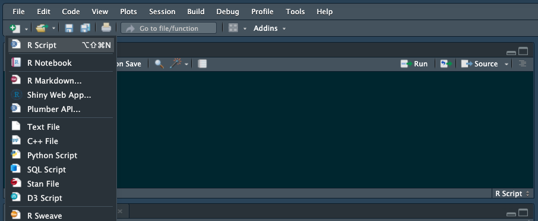

[`Estadística con R`]> `General Notebooks: Estadística y Programacion con R`

## Work: Scripts con R

### OBJETIVOS DE LA SESIÓN

- Entender el concepto de script en R
- Utilizar un script para análisis de archivos
- Tomar un data set real y hacer preguntas interesantes sobre los datos
- Programar funciones para tareas comunes de lectura, escritura  de archivos con loops en R
- Saber como revisar (debug) un script en R paso a paso
- Utilizar funciones matemáticas en R 

#### ORGANIZACION DE LA SESIÓN

- Creación de un script en R con funciones y argumentos 
	- [Ejemplo 01](Ejemplo-01)

- Funciones append, completecases, rbind, list.files, vector, tipos de acceso a valores en dataframes
	- [Ejemplo 02](Ejemplo-02)
	- [Reto 02](Reto-02)

### OBJETIVO EJEMPLO 2
- Generar un script en R con tareas complejas implementadas mediante funciones

#### REQUISITOS EJEMPLO 2
1. Contar con R studio.
1. Usar la carpeta de trabajo `Sesion02/Ejemplo-02`

#### DESARROLLO EJEMPLO 2
En esta sección vamos a crear varias funciones con tareas de programación intermedia.

Para esto hay que abrir el editor de scripts con un script nuevo:


Limpiamos el workspace como buena práctica de programación:
```{r}
rm(list=ls())
```
Vas a escribir una función llamada remainder, remainder() tomará dos argumentos: "num" y "divisor" donde "num" se divide por "divisor" y se devuelve el resto. Imagina que generalmente desea saber el residuo cuando se divide entre 2, por lo tanto, establece el valor predeterminado de "divisor" en 2 (por default del argumento). Asegurate de que "num" es el primer argumento y "divisor" es el segundo argumento.
Sugerencia # 1: puede utilizar el operador de módulo %% para encontrar el resto.
Ej: 7 %% 4 se evalúa como 3.
```{r}
remainder <- function(num, divisor=2) {
  remainder <- num %% divisor
  # Recuerda: El valor de la última expresión evaluada es lo que se regresá (return)! 
}
```
Hagamos algunas pruebas de la función restante. Ejecute remainder(5) y vea qué sucede.
Tomemos un momento para examinar lo que acaba de suceder. Usted proporcionó un argumento para la función, y R hizo coincidir ese argumento con 'num' ya que 'num' es el primer argumento. El valor predeterminado para 'divisor' es 2, por lo que la función utilizó el valor predeterminado que proporcionó.

Ahora probemos la función restante proporcionando dos argumentos. Introduzca en el prompt > remainder(11, 5) y veamos qué pasa.
```{r}
remainder(11,5)
```
También puede especificar explícitamente argumentos en una función. Cuando designa explícitamente un argumento valores por nombre, el orden de los argumentos deja de ser importante. Puedes probar esto escribiendo: remainder(divisor = 11, num = 5).
Como puede ver, hay una diferencia significativa entre el resto (11, 5) y el resto (divisor = 11, num = 5)!

Con toda esta charla sobre argumentos, puede que se pregunte si hay una manera de ver los argumentos de la función (además de mirar la documentación). Afortunadamente, puedes usar la funciín args (). Escriba: args(remainder) para examinar los argumentos de la función remainder.

### OBJETIVO RETO 2
- Generar un script en R con tareas complejas implementadas mediante funciones

#### REQUISITOS RETO 2
1. Contar con R studio.
1. Usar la carpeta de trabajo `Sesion02/Ejemplo-02`

#### DESARROLLO RETO 2
En esta sección vamos a crear varias funciones con tareas de programación intermedia.

Para esto hay que abrir el editor de scripts con un script nuevo:


Limpiamos el workspace como buena práctica de programación:
```{r}
rm(list=ls())
```

