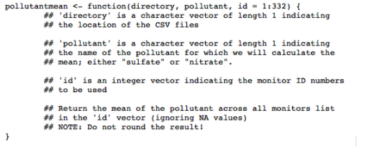
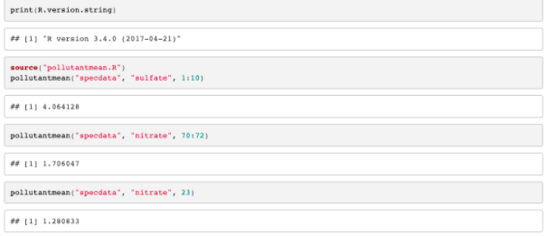
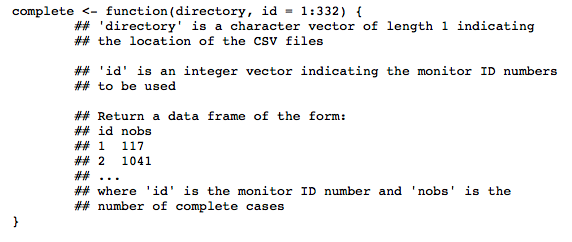
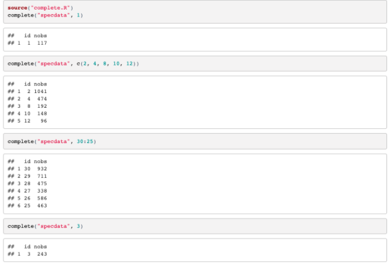
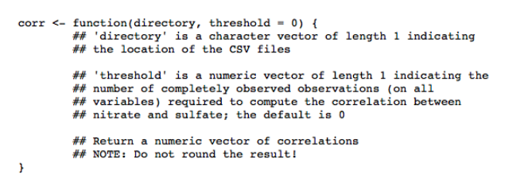
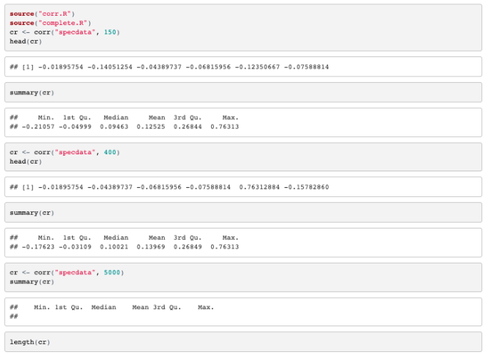

## Scripts con R

### OBJETIVO
  - Que el alumno sepa resolver tareas interesantes y complejas para la lectura y análisis de archivos con scripts en R

### REQUISITOS

Datos
El archivo zip que contiene los datos se puede descargar aquí:

 [DataSet Contaminantes en Aire](../Dataset/rprog_data_specdata.zip)

### RETO a resolver por el alumno

El archivo zip contiene 332 archivos de valores separados por comas (CSV) que contienen datos de monitoreo de la contaminación del aire de partículas finas (PM) en 332 ubicaciones en los Estados Unidos. Cada archivo contiene datos de un solo monitor y el número de identificación de cada monitor está contenido en el nombre del archivo. Por ejemplo, los datos para el monitor 200 están contenidos en el archivo "200.csv". Cada archivo contiene tres variables:

Fecha: la fecha de la observación en formato AAAA-MM-DD (año-mes-día)
sulfato: el nivel de sulfato de PM en el aire en esa fecha (medido en microgramos por metro cúbico) de
nitrato: el nivel de nitrato de PM en el aire en esa fecha (medido en microgramos por metro cúbico)
Para esta asignación de programación, necesitará descomprimir este archivo y crear el directorio 'specdata'. Una vez que haya descomprimido el archivo zip, no realice modificaciones en los archivos del directorio 'specdata'. En cada archivo, notará que hay muchos días en los que faltan sulfato o nitrato (o ambos) (codificados como NA). Esto es común con los datos de monitoreo de la contaminación del aire en los Estados Unidos.

1- Parte 1
Escriba una función llamada 'medio contaminante' que calcule la media de un contaminante (sulfato o nitrato) en una lista específica de monitores. La función 'contaminante' toma tres argumentos: 'directorio', 'contaminante' e 'id'. Dados los números de identificación de un monitor vectorial, 'contaminante medio' lee que monitorea los datos de materia particulada del directorio especificado en el argumento 'directorio' y devuelve la media del contaminante en todos los monitores, ignorando cualquier valor faltante codificado como NA. Un prototipo de la función es el siguiente

   

. Puede ver algunos resultados de ejemplo de esta función a continuación. La función que escriba debería poder coincidir con esta salida. Guarde su código en un archivo llamado pollutantmean.R.

   

2- Parte 2
Escriba una función que lea un directorio lleno de archivos e informe el número de casos completamente observados en cada archivo de datos. La función debe devolver un marco de datos donde la primera columna es el nombre del archivo y la segunda columna es el número de casos completos. Sigue un prototipo de esta funcións

   

Puede ver algunos resultados de ejemplo de esta función a continuación. La función que escriba debería poder coincidir con esta salida. Guarde su código en un archivo llamado complete.R. Para ejecutar el script de envío para esta parte, asegúrese de que su directorio de trabajo tenga el archivo complete.R en él.

   

3- Parte 3
Escriba una función que tome un directorio de archivos de datos y un umbral para casos completos y calcule la correlación entre sulfato y nitrato para ubicaciones de monitoreo donde el número de casos completamente observados (en todas las variables) es mayor que el umbral. La función debe devolver un vector de correlaciones para los monitores que cumplen con el requisito de umbral. Si ningún monitor cumple con el requisito de umbral, entonces la función debe devolver un vector numérico de longitud 0. A continuación se muestra un prototipo de esta función.

   

Para esta función, deberá utilizar la función 'cor' en R, que calcula la correlación entre dos vectores. Lea la página de ayuda para esta función a través de '?Cor' y asegúrese de saber cómo usarla.
Puede ver algunos resultados de ejemplo de esta función a continuación. La función que escriba debería poder coincidir aproximadamente con esta salida. Tenga en cuenta que debido a cómo R redondea y presenta números de coma flotante, la salida que genera puede diferir ligeramente de la salida de ejemplo. Guarde su código en un archivo llamado corr.R. Para ejecutar el script de envío para esta parte, asegúrese de que su directorio de trabajo tenga el archivo corr.R.

   

