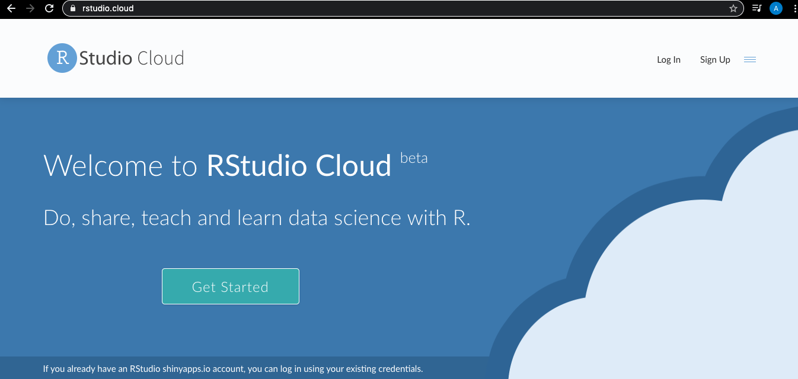
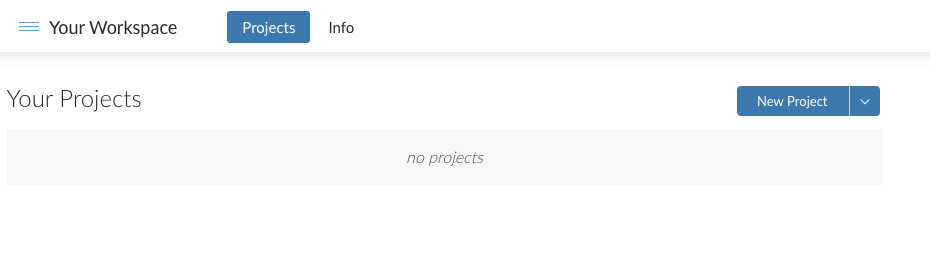
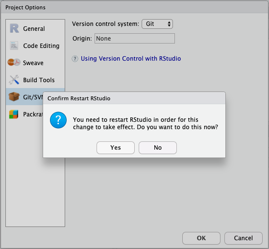

`Estadistica-Programacion-con-R` > [`Programacion con R`] > [`Sesion-03`] > [`Ejemplo-01`] 
### OBJETIVO
- Conocer el ambiente de desarrollo en la nube para RStudio específicamente RStudio Cloud.

#### REQUISITOS
1. Leer prework sobre como crear una cuenta de R Studio Cloud.
1. Usar la carpeta de trabajo `Sesion03/Ejemplo-01`

#### DESARROLLO

Entramos a la dirección web: 

y creamos una cuenta en las sección de Sign Up, después hacemos Log In. 


Una vez en el workspace creamos un projecto dando click en el botón correspondiente: 


después verémos como se inicializa nuestro front end en cloud! de RStudio. Así es como podrías trabajar con Rstudio Cloud en general.
Como podemos observar es igual al de RStudio Desktop, ahora exploraremos los objetivos de esta clase, que son las interfaces con aplicaciónes externas y repositorios.

Sin embargo, la manera más profesional de trabajar es cuando onectemos Rstudio Cloud con nuestro repositorio de trabajo en github, para esto tenemos que crear un nuevo projecto desde el inicio con la opción de utilizar un repositorio Git Hub.



y crear un nuevo proyecto desde un repositorio Git hub. Para esto sigamos las siguientes instrucciones,


Ahora 
```{r}

}
```
En 
```{r}

```

