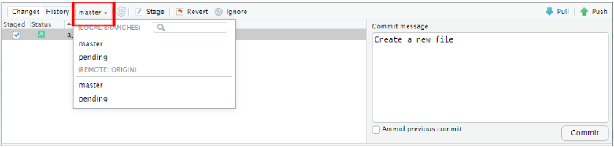
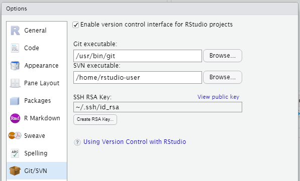
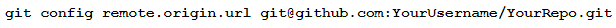
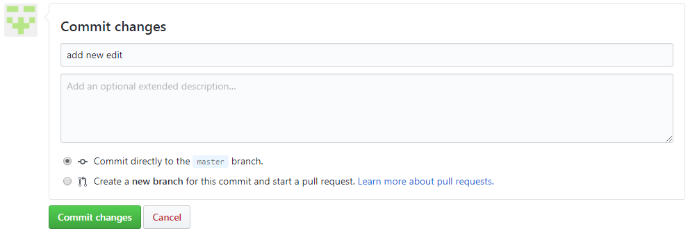
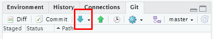

`Estadistica-Programacion-con-R` > [`Programacion con R`] > [`Sesion-03`] > [`Actividad-01`] 
### OBJETIVO
- Conocer el ambiente de desarrollo en la nube para RStudio específicamente RStudio Cloud.

#### REQUISITOS
1. Leer prework sobre como crear una cuenta de R Studio Cloud.

#### DESARROLLO

Entramos a la dirección web: 

y creamos una cuenta en las sección de Sign Up, después hacemos Log In. 

Una vez en el workspace creamos un projecto dando click en el botón correspondiente: 

después verémos como se inicializa nuestro front end en cloud! de RStudio. Así es como podrías trabajar con Rstudio Cloud en general.
Como podemos observar es igual al de RStudio Desktop, ahora exploraremos los objetivos de esta clase, que son las interfaces con aplicaciónes externas y repositorios.

Sin embargo, la manera más profesional de trabajar es cuando onectemos Rstudio Cloud con nuestro repositorio de trabajo en github, para esto tenemos que crear un nuevo projecto desde el inicio con la opción de utilizar un repositorio Git Hub. Para esto sigamos las siguientes instrucciones,

### 1) Configuración de RStudio Cloud

1. Crear un repositorio vacío en Github

2. Cree un nuevo proyecto en RStudio Cloud: vaya a RStudio Cloud y haga clic en la flecha al lado de "Nuevo proyecto". En el menú desplegable, seleccione "Nuevo proyecto de Git Repo".

Copie y pegue la URL de su repositorio de Github en el cuadro de solicitud. Ahora su proyecto RStudio Cloud está conectado a su repositorio de Github. Cualquier cambio realizado en RStudio Cloud puede reflejarse en Github (Escenario A) y viceversa (Escenario B).

Escenario A: empujar cambios en RStudio Cloud a Github

Configurar git en RStudio Cloud

a. Haz clic en la pestaña Terminal en el panel inferior dentro de su proyecto RStudio Cloud.

b. Dentro de Terminal, escribe los siguientes comandos pero reemplaza you@example.com con tu dirección de correo electrónico real y tu nombre con tu nombre real entre comillas:

Esto registrará cualquier cambio que realice bajo su identidad de usuario específica y hará un seguimiento de quién realizó qué modificaciones.

2. Cometer cambios en Git

a. Guarde todos los archivos en RStudio Cloud que haya editado, si aún no lo ha hecho.

b. En el panel derecho, vaya a la pestaña en el extremo derecho que dice "Git". En esa pestaña, debería ver los archivos que editó y guardó. Haga clic en el cuadro debajo de "En escena" para seleccionar el archivo que desea actualizar en Github.

c. Haga clic en el botón "Confirmar" en la barra de herramientas. Básicamente, esto guarda los cambios en Git para que pueda enviarlos a Github.

d. Aparecerá una ventana que muestra los cambios que ha realizado. Coloque un mensaje de confirmación, que es una breve descripción de los cambios que ha realizado, y haga clic en Confirmar.

3. Empuje los cambios a Github

a. Elija la rama a la que desea enviar los cambios seleccionándola en el menú desplegable y luego haga clic en el botón con la flecha verde hacia arriba. (Esto también se puede hacer en la ventana principal de RStudio Cloud en la barra de herramientas de la pestaña Git).

b. Una ventana emergente le pedirá que ingrese su nombre de usuario y contraseña para Github. Siga las instrucciones que se le indiquen.

c. Opcional: puede ir a Github y verificar su repositorio de Github para confirmar que sus cambios se enviaron correctamente a Github.

4.  OPCIONAL: evite tener que escribir el nombre de usuario y la contraseña cada vez que desee enviar una edición a Github

a. En la barra de herramientas superior de su proyecto RStudio Cloud, haga clic en "Herramientas" y seleccione "Opciones globales ..." en el menú desplegable

b. De la lista de opciones en el lado izquierdo de la ventana emergente, seleccione Git / SVN.

c. Haga clic en el botón "Crear clave RSA". Aparecerá otro mensaje emergente; haga clic en "Crear". Haga clic en Ver clave pública y copie la clave en el portapapeles.

d. Navegue a Github y vaya a su perfil haciendo clic en la esquina superior derecha donde está su avatar y seleccionando "Su perfil" en el menú desplegable. En el lado izquierdo de su página de perfil, seleccione "Editar perfil".

e. Vaya a "Claves SSH y GPG" y haga clic en el botón "Nueva clave SSH". Asigne un título a su clave y péguela en el cuadro de texto Clave. Luego haga clic en "Agregar clave SSH"

F. Vuelva a su proyecto de RStudio Cloud y vaya a la pestaña Terminal en el panel inferior de su ventana. En el terminal, escriba lo siguiente, pero reemplace YourUsername y YourRepo con su nombre de usuario de Github y el nombre del repositorio de Github (como está escrito en la URL de su repositorio de Github):

Scenario B: Pulling changes from Github to RStudio Cloud

1. Commit changes in Github. This is done via a form at the bottom of your file in Github - fill out a brief description of the changes you’re committing, and select “Commit directly to the master branch.” Then click “Commit changes”.

2. Pull changes from Github. 

a. In RStudio Cloud, go to your corresponding RStudio Cloud project.

b. On the right panel, go to the tab on the far right that says “Git.” On the toolbar, click the blue arrow pointing downwards. This will pull the changes you made from Github into RStudio Cloud. The file should automatically be updated after you click.

