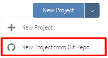

`Estadistica-Programacion-con-R` > [`Programacion con R`] > [`Sesion-03`] > [`Actividad-01`] 
### OBJETIVO
- Conocer el ambiente de desarrollo en la nube para RStudio específicamente RStudio Cloud.

#### REQUISITOS
1. Leer prework sobre como crear una cuenta de R Studio Cloud.

#### DESARROLLO

Entramos a la dirección web: 

y creamos una cuenta en las sección de Sign Up, después hacemos Log In. 

Una vez en el workspace creamos un projecto dando click en el botón correspondiente: 


después verémos como se inicializa nuestro front end en cloud! de RStudio. Así es como podrías trabajar con Rstudio Cloud en general.
Como podemos observar es igual al de RStudio Desktop, ahora exploraremos los objetivos de esta clase, que son las interfaces con aplicaciónes externas y repositorios.

Sin embargo, la manera más profesional de trabajar es cuando onectemos Rstudio Cloud con nuestro repositorio de trabajo en github, para esto tenemos que crear un nuevo projecto desde el inicio con la opción de utilizar un repositorio Git Hub. Para esto sigamos las siguientes instrucciones,

### 1) Configuración de RStudio Cloud

1. Crear un repositorio vacío en Github

2. Cree un nuevo proyecto en RStudio Cloud: vaya a RStudio Cloud y haga clic en la flecha al lado de "Nuevo proyecto". En el menú desplegable, seleccione "Nuevo proyecto de Git Repo".



Copie y pegue la URL de su repositorio de Github en el cuadro de solicitud. Ahora su proyecto RStudio Cloud está conectado a su repositorio de Github. Cualquier cambio realizado en RStudio Cloud puede reflejarse en Github (Escenario A) y viceversa (Escenario B).

Escenario A: empujar cambios en RStudio Cloud a Github

Configurar git en RStudio Cloud

a. Haz clic en la pestaña Terminal en el panel inferior dentro de su proyecto RStudio Cloud.


b. Dentro de Terminal, escribe los siguientes comandos pero reemplaza you@example.com con tu dirección de correo electrónico real y tu nombre con tu nombre real entre comillas:


Esto registrará cualquier cambio que realice bajo su identidad de usuario específica y hará un seguimiento de quién realizó qué modificaciones.

2. Cometer cambios en Git

a. Guarde todos los archivos en RStudio Cloud que haya editado, si aún no lo ha hecho.

b. En el panel derecho, vaya a la pestaña en el extremo derecho que dice "Git". En esa pestaña, debería ver los archivos que editó y guardó. Haga clic en el cuadro debajo de "En escena" para seleccionar el archivo que desea actualizar en Github.


Ahora 
```{r}

}
```
En 
```{r}

```

