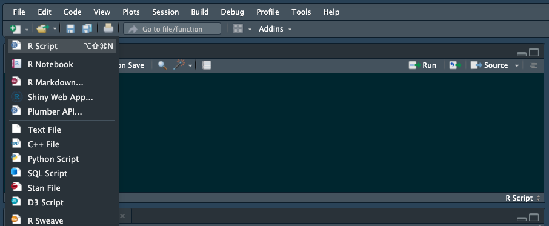

`Estadistica-Programacion-con-R` > [`Programacion con R`] > [`Sesion-03`] > [`Actividad-02`] 

### OBJETIVO
- Integrar Rstudio con BDs mediante librerías, drivers (odbc drivers) ó el connect pane.

#### REQUISITOS
1. Contar con R studio.
1. Usar la carpeta de trabajo `Sesion03/Ejemplo-02`

#### DESARROLLO

### MySQL

Hay dos opciones para conectarse a una base de datos MySQL:

Usar el odbcpaquete con un controlador de base de datos
Usando el RMariaDBpaquete
Usando el odbcpaquete
El odbcpaquete, en combinación con un controlador, proporciona DBIsoporte y una conexión ODBC
Como ya conocemos, así es como se define una función en R:
```{r}

{
#	Manipular argumentos arg1 y arg2 de cierta forma y regresar un valor
}
```
  
```{r}
boring_function <- function(x) {
  x
}
```

```{r}

```

### Ahora 

Para esto hay que abrir el editor de scripts con un script nuevo:


Ahora 
```{r}

}
```
En 
```{r}

```
Paragraph
